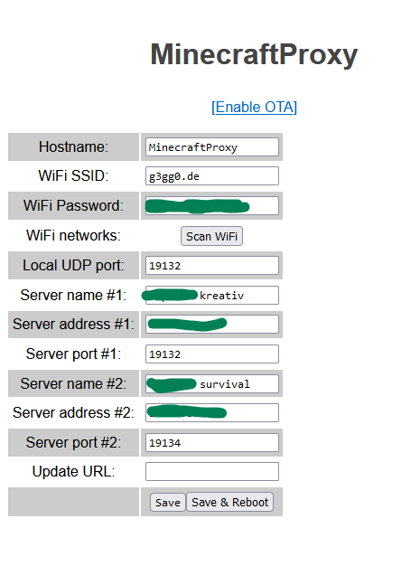

# MinecraftProxy

This is a ESP32 compatible LAN-to-dedicated server proxy, similar to [proxy phantom](https://github.com/jhead/phantom).
It listens on the local network for minecraft's discovery messages and replies them, while also forwarding to the configured server.
When the server responds, the packets get forwarded to the requesting host.

Using this proxy you can play with your Playstation 4 or Xbox on dedicated bedrock servers.
It shows up as a local LAN server and acts like one, just by forwarding all packets to the internet server you configured.

The current implementation only supports one client connection and will probably fail if you try so.

## Server announcement
When starting up, the sketch toggles between your configured servers, switching after every restart.
So you can set up two different servers and choose which one you want to connect by resetting your ESP32.

There is an extra server entry shown for a status information.
Within the first few seconds, you might see this status message:

If the response times out, an error message is shown.

However, if everything goes well you get your deidcated server listed with a "via proxy" prefix.
Now you can connect to it as if the server was in your LAN.

## Configuration
Before connecting, you have to configure your WiFi and server settings.
You can either hardcode these settings in Config.ino or use the AP mode of this sketch.

Whenever the WiFi connection fails, the sketch creates an access point named "esp32-minecraft", you have to connect to.
In theory your mobile should open the captive portal, I tried to implement. However that doesn't seem to work although I answer all DNS queries with a 302 to http://192.168.4.1/

So until someone figures out how to fix this, you have to follow http://192.168.4.1/ manually and enter your WiFi credentials there.

